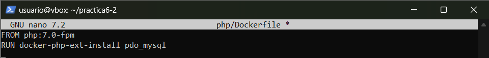

# Despliegue de una aplicación PHP con Nginx y MySQL usando Docker y docker-compose

## Estructura de Directorios

Primero, creamos la estructura de directorios necesaria para contener los archivos de configuración y la aplicación.

```bash
mkdir -p /home/usuario/practica6-2/{nginx,php,www/html}
cd practica6-2
touch docker-compose.yml
touch Dockerfile
touch nginx/default.conf
touch php/Dockerfile
touch www/html/index.php
```


Dentro de la carpeta /home/usuario/practica6-2/, se generan las siguientes carpetas y archivos:

```swift
/home/usuario/practica6-2/
├── docker-compose.yml
├── nginx
│   ├── default.conf
│   └── Dockerfile
├── php
│   └── Dockerfile
└── www
    └── html
        └── index.php
```


## Creación del contenedor de Nginx

Primero, configuramos el contenedor de Nginx. En el archivo docker-compose.yml, especificamos lo siguiente:

```yml
nginx:
  assets/images2/image: nginx:latest
  container_name: nginx-container
  ports:
    - 80:80
```

Esta configuración será la encargada de descargarse la última versión de la assets/images2/imagen de Nginx, creando un contenedor con ella y publicar o escuchar en el puerto 80.


Ejecutamos el contenedor con:

```bash
sudo docker-compose up -d
```


Al ejecutar docker ps, confirmamos que el contenedor de Nginx está corriendo. Luego, accedemos a `http/192.168.76.147` (en mi caso) y vemos la página de bienvenida de Nginx.


## Creación del contenedor PHP

El siguiente paso es crear el contenedor PHP. PAra ello editaremos el archivo index.php dentro de www/html/:

```php
<!DOCTYPE html>
<head>
  <title>¡Hola mundo!</title>
</head>
<body>
  <h1>¡Hola mundo!</h1>
  <p><?php echo 'Estamos corriendo PHP, version: ' . phpversion(); ?></p>
</body>
</html>
```


A continuación, configuramos el archivo default.conf dentro de la carpeta nginx/:

```nginx
server {
    listen 80 default_server;
    root /var/www/html;
    index index.html index.php;

    charset utf-8;

    location / {
        try_files $uri $uri/ /index.php?$query_string;
    }

    location = /favicon.ico { access_log off; log_not_found off; }
    location = /robots.txt { access_log off; log_not_found off; }

    access_log off;
    error_log /var/log/nginx/error.log error;

    sendfile off;

    client_max_body_size 100m;

     location ~ .php$ {
        fastcgi_split_path_info ^(.+.php)(/.+)$;
        fastcgi_pass php:9000;
        fastcgi_index index.php;
        include fastcgi_params;
        fastcgi_param SCRIPT_FILENAME $document_root$fastcgi_script_name;
        fastcgi_intercept_errors off;
        fastcgi_buffer_size 16k;
        fastcgi_buffers 4 16k;
    }

    location ~ /.ht {
        deny all;
    }
}
```


El Dockerfile en la carpeta nginx/:

```Dockerfile
FROM nginx:latest
COPY ./default.conf /etc/nginx/conf.d/default.conf
```


Finalmente, actualizamos el docker-compose.yml para agregar el contenedor PHP y asociarlo al contenedor Nginx:

```yml
services:
  nginx:
    build: ./nginx/
    container_name: nginx-container
    ports:
      - 80:80
    links:
      - php
    volumes:
      - ./www/html/:/var/www/html/

  php:
    assets/images2/image: php:7.0-fpm
    container_name: php-container
    expose:
      - 9000
    volumes:
      - ./www/html/:/var/www/html/
```


Ejecutamos nuevamente el comando:

```bash
sudo docker-compose up -d
```


Accedemos a `http://192.168.76.147` y vemos la página "¡Hola mundo!", confirmando que PHP está funcionando correctamente.


## Creación de un contenedor de datos

Para mejorar la persistencia de los datos, creamos un contenedor independiente que se encargará de almacenar los datos de la aplicación:

```yml
services:
  nginx:
    build: ./nginx/
    container_name: nginx-container
    ports:
      - 80:80
    links:
      - php
    volumes_from:
      - app-data

  php:
    assets/images2/image: php:7.0-fpm
    container_name: php-container
    expose:
      - 9000
    volumes_from:
      - app-data

  app-data:
    assets/images2/image: php:7.0-fpm
    container_name: app-data-container
    volumes:
      - ./www/html/:/var/www/html/
    command: "true"
```


Ejecutamos nuevamente `sudo docker-compose up -d` para crear y lanzar los contenedores.


Ahora vemos que todos están corriendo correctamente con el comando `sudo docker ps -a`.


## Creación de un contenedor MySQL

Para conectar PHP con MySQL, añadimos un contenedor para MySQL en el archivo docker-compose.yml. Primero, instalamos la extensión pdo_mysql en PHP creando el Dockerfile dentro de php/:

```Dockerfile
FROM php:7.0-fpm
RUN docker-php-ext-install pdo_mysql
```



Luego, actualizamos docker-compose.yml:

```yml
services:
  nginx:
    build: ./nginx/
    container_name: nginx-container
    ports:
      - 80:80
    links:
      - php
    volumes_from:
      - app-data
  php:
    build: ./php/
    container_name: php-container
    expose:
      - 9000
    links:
      - mysql
    volumes_from:
      - app-data

  app-data:
    assets/images2/image: php:7.0-fpm
    container_name: app-data-container
    volumes:
      - ./www/html/:/var/www/html/
    command: "true"

  mysql:
    assets/images2/image: mysql:5.7
    container_name: mysql-container
    volumes_from:
      - mysql-data
    environment:
      MYSQL_ROOT_PASSWORD: secret
      MYSQL_DATABASE: mydb
      MYSQL_USER: myuser
      MYSQL_PASSWORD: password

  mysql-data:
    assets/images2/image: mysql:5.7
    container_name: mysql-data-container
    volumes:
      - /var/lib/mysql
    command: "true"
```


Creamos o modificamos el archivo index.php para conectar con la base de datos MySQL y verificar las tablas.

```php
<!DOCTYPE html>
<html>
    <head>
      <title>¡Hola mundo!</title>
    </head>

    <body>
        <h1>¡Hola mundo!</h1>
        <p><?php echo 'Estamos corriendo PHP, version: ' . phpversion(); ?></p>
        <?
        $database ="mydb";
        $user = "myuser";
        $password = "password";
        $host = "mysql";

        $connection = new PDO("mysql:host={$host};dbname={$database};charset=utf8", $user, $password);
        $query = $connection->query("SELECT TABLE_NAME FROM information_schema.TABLES WHERE TABLE_TYPE='BASE TABLE'");
        $tables = $query->fetchAll(PDO::FETCH_COLUMN);

        if (empty($tables)) {
            echo "<p>No hay tablas en la base de datos \"{$database}\".</p>";
        } else {
            echo "<p>La base de datos \"{$database}\" tiene las siguientes tablas:</p>";
            echo "<ul>";
            foreach ($tables as $table) {
                echo "<li>{$table}</li>";
            }
            echo "</ul>";
        }
        ?>
    </body>
</html>
```


Finalmente, ejecutamos `sudo docker-compose up -d` para arrancar los contenedores.


## Verificación de la conexión a MySQL

Accedemos a http://<IP_Maq_Virtual> y, si todo está bien configurado, deberíamos ver una lista de las tablas de la base de datos MySQL.


Esto no es realmente así, sino que no son visibles para un usuario normal, simplemente hay que cambiar el `index.php` y cambiar el usuario y la contraseña


## Esquema de la Infraestructura Completa

La infraestructura final consta de los siguientes contenedores:


---------
Author: Jorge Pradillo Hinterberger