# Práctica 6.3 - Despliegue de servidores web con usuarios autenticados mediante LDAP usando Docker y Docker Compose

## Despliegue con Docker de NGINX con dominio de autenticación LDAP y OpenLDAP

### Creación del index.html

Primero crearemos un directorio `app` con un `index.html` básico. Para ello simplemente ejecutaremos los siguiente comandos:

```bash
mkdir practica6-3
cd practica6-3
mkdir app
cd app
sudo nano index.html
```

Y en el `index.html` escribiremos lo siguiente: 

```html
<html>
<body>
    <h1>¡Hola Mundo!</h1>
</body>
</html>
```

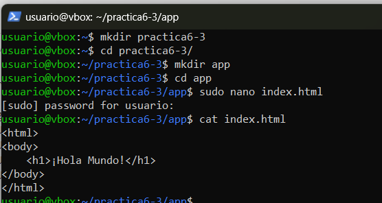

### Configuración Nginx

Una vez hecho esto crearemos otro directorio con la configuración de `Nginx` que contenga el siguiente contenido:

```
server {
    listen 8080;

    location = / {
        auth_request /auth-proxy;
    }

    location = /auth-proxy {
        internal;

        proxy_pass http://nginx-ldap:8888;

        # URL y puerto para conectarse al servidor LDAP
        proxy_set_header X-Ldap-URL "ldap://openldap:1389";

        # Base DN
        proxy_set_header X-Ldap-BaseDN "dc=example,dc=org";

        # Bind DN
        proxy_set_header X-Ldap-BindDN "cn=admin,dc=example,dc=org";

        # Bind password
        proxy_set_header X-Ldap-BindPass "adminpassword";
    }
}
```

Para ello crearemos un directorio `conf` y en el crearemos el documento `ldap_nginx.conf` con la configuración indicada anteriormente

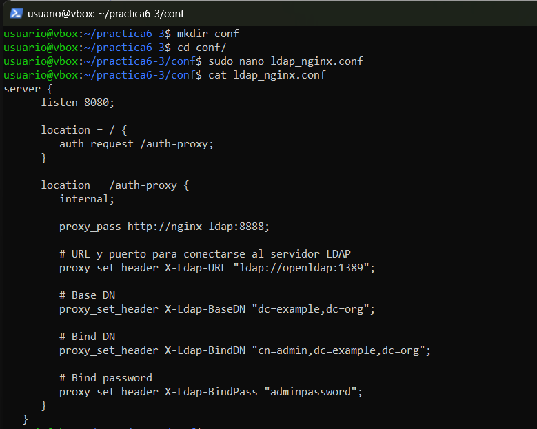

Aquí le estamos diciendo a `Nginx` lo siguiente:

1. Que escuche en el puerto 8080 las peticiones HTTP

2. Que cuando se acceda al sitio web, se solicite autorización en el directorio del sitio web llamado /auth-proxy

3. Se crea un nuevo location para ese directorio /auth-proxy y que es donde se realizará la configuración de cómo conectarnos a nuestro openldap, de acuerdo con la documentación oficial de Nginx a propósito de su módulo de autenticación:

4. Se indica la URL de nuestro openldap (es el nombre del contenedor que hemos levantado, ya que Docker tiene un DNS propio entre sus contenedores)

5. El DN (Nombre distinguido) base sobre el que se realizarán las búsquedas en openldap


6. El usuario y contraseña con el que nos conectaremos al openldap para realizar las consultas

### Docker-compose

Una vez configurado `Nginx` procedemos a configurar el `docker-compose`

Para ello crearemos el archivo `docker-compose.yml` y le pegaremos el código siguiente que lo que hará es configurar un entorno con `Nginx protegido por autenticación LDAP` usando `OpenLDAP`.

```ylm
version: '2'

services:
  nginx-ldap:  # 
    assets/images3/image: bitnami/nginx-ldap-auth-daemon-archived # 
    ports: # 
      - 8888:8888
  nginx: # 
    assets/images3/image: bitnami/nginx
    ports: 
     - 8080:8080
    volumes: # 
     - ./app:/app
     - ./conf/ldap_nginx.conf:/opt/bitnami/nginx/conf/server_blocks/ldap_nginx.conf
  openldap: # 
    assets/images3/image: bitnami/openldap
    ports:
      - '1389:1389'    
    environment: # 
      - LDAP_ADMIN_USERNAME=admin
      - LDAP_ADMIN_PASSWORD=adminpassword
      - LDAP_USERS=customuser
      - LDAP_PASSWORDS=custompassword
```

1. openldap - Servidor LDAP con usuarios predefinidos

2. nginx-ldap - Servicio de autenticación LDAP para Nginx

3. nginx - Servidor web que usa LDAP para autenticar usuarios

Antes de acceder a los recursos servidos por `Nginx`, los usuarios deberán autenticarse.

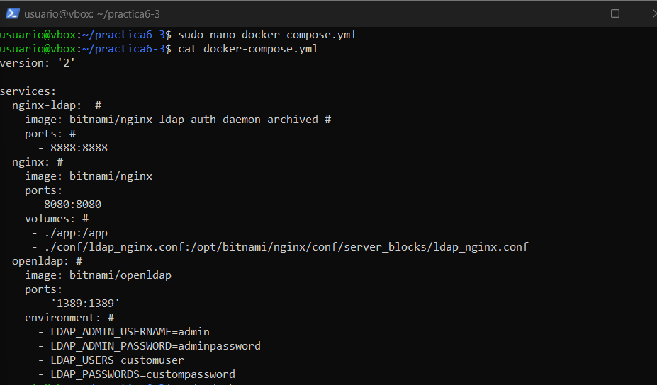

### Inicialización de los contenedores

Una vez hecho esto simplemente tenemos que iniciar los contenedores con el comando `sudo docker-compose up`. Y una vez hecho esto accedemos a la siguiente url.

[http://IP_Maquina_virtual:8080](http://192.168.76.147:8080)

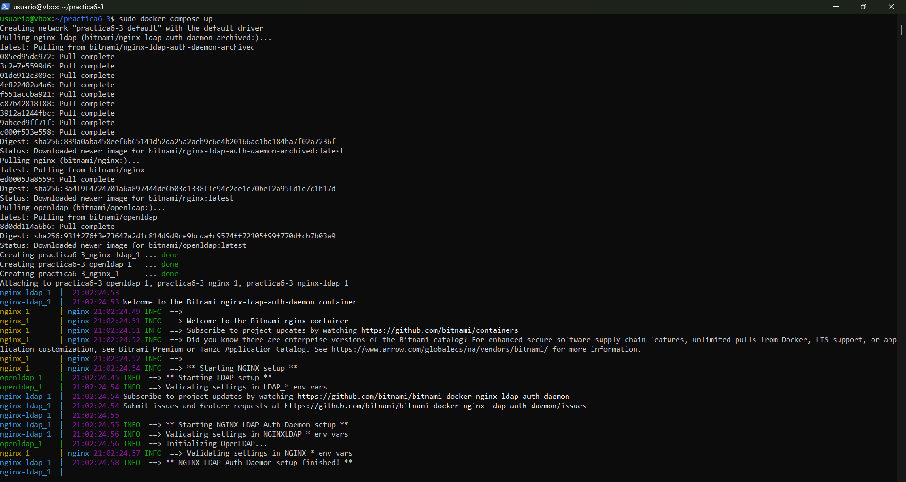

Al acceder a la url anterior, nos pedirá las credenciales que hemos configurado anteriormente las cuales son:

* Usuario: customuser
* Contraseña: custompassword

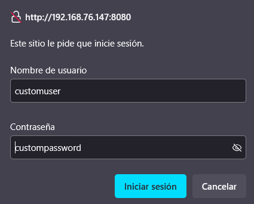

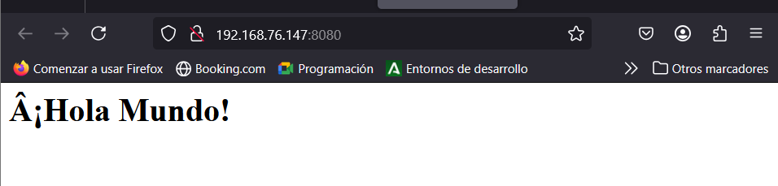

## Despliegue de PHP y Apache con autenticación LDAP

### Archivo index.php

Para esto, primero crearemos un archivo que se llame `index.php` en el directorio `practica6-3`.

```bash
sudo nano index.php
```

En este archivo escribiremos el siguiente script:

```php
<?php
echo "Ey, hola usuario autenticado por LDAP!";
?>
```

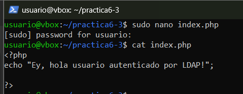

### Dokerfile

Luego, dentro de nuestro directorio de trabajao crearemos otro directorio `Docker` con el archvio `Dockerfile` en el que añadiremos las opciones o directivas adecuadas para que se cree una assets/images3/imagen de Docker basada en PHP con Apache y configurar la autenticación LDAP en Apache.

El scrip que debemos meter sería el siguiente:

```bash
# ./Docker/Dockerfile --> directorio donde se encuentra este archivo

# Imagen base sobre la que vamos a trabajar
FROM php:7-apache

# Activamos el módulo LDAP de Apache ejecutand el siguiente comando
RUN a2enmod authnz_ldap

# Añadimos las reglas/configuración de LDAP al directorio conf-enabled de Apache
# (crearemos este archivo en el siguiente paso)
COPY Docker/ldap-demo.conf /etc/apache2/conf-enabled/

# Añadimos ayuda de depuración (debugging) en la configuración de apache
# En caso de necesitarlo, lo descomentamos para ejecutar el siguiente comando
# RUN echo "LogLevel debug" >> apache2.conf

# Establecemos el directorio de trabajo adecuado
WORKDIR /var/www/html/demo


# Configuramos Apache para usar la configuración ldap definida arriba, la copiamos de nuestro ordenador al contenedor
COPY Docker/.htaccess ./.htaccess

#  Copiamos los archivos del proyecto que necesitamos, al contenedor

COPY index.php ./
```

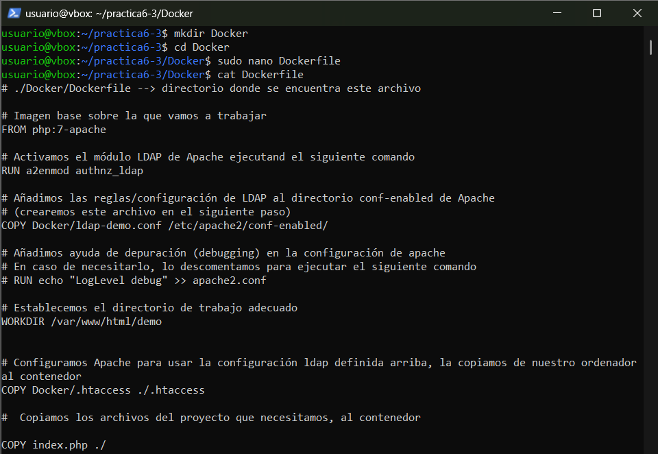

### Configuración LDAP

Posteriormente creamos el archivo `ldap-demo.conf` que contendrá toda la configuración `LDAP`. Aquí se establecerán los criterios de conexión con el contenedor Openldap, password y la URL.

```bash
# ./Docker/ldap-demo.conf
PassEnv LDAP_BIND_ON    
PassEnv LDAP_PASSWORD
PassEnv LDAP_URL
<AuthnProviderAlias ldap demo>
    AuthLDAPBindDN ${LDAP_BIND_ON}
    AuthLDAPBindPassword ${LDAP_PASSWORD}
    AuthLDAPURL ${LDAP_URL}
</AuthnProviderAlias> 
```

Las directivas `PassEnv` al inicio del archivo, omiten nuestras credenciales y las pasa como variables de entorno al correr la assets/images3/imagen del contenedor.

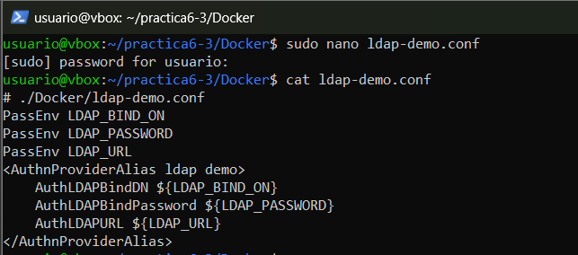

### Archivo de configuración Apache

Luego crearemos el archivo `.htadccess` que se encargará de configurar la autenticación básica en Apache para proteger el acceso al sitio web.

```bash
# .Docker/.htaccess
AuthBasicProvider demo
AuthType Basic
AuthName "Protected Area"
Require valid-user
```

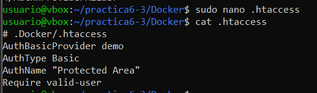

### Construcción de la assets/images3/imagen 

Ahora, con el siguiente comando, construiremos la assets/images3/imagen en nuestro directorio de trabajo: 

```bash
sudo docker build . -t docker-ldap -f ./Docker/Dockerfile
```

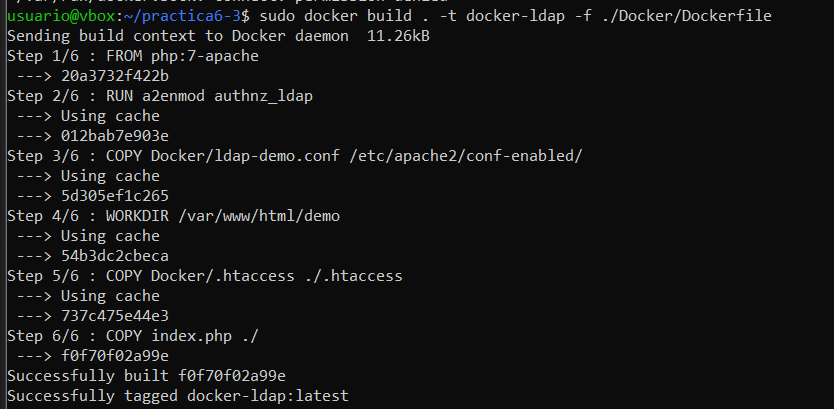

### Corremos el contenedor

Ahora correremos el contenedor indicando las credenciales de nuestra cuenta LDAP mediante variables de entorno con la flag `-e`. En este caso probaremos con un servidor externo simulando que tuvieramos que integrar nuestro despliegue con un servidor ya existente en la empresa. 

El servidor utilizado será [https://www.freipa.org/page/Demo](https://www.freipa.org/page/Demo). En esta misma web se pueden consultar usuarios y contraseñas para poder acceder a la página.

```bash
sudo docker run -p 3000:80 --name ldap_demo -e LDAP_BIND_ON='uid=admin,cn=users,cn=accounts,dc=demo1,dc=freeipa,dc=org' -e LDAP_PASSWORD='Secret123' -e LDAP_URL='LDAP://ipa.demo1.freeipa.org' docker-ldap
```

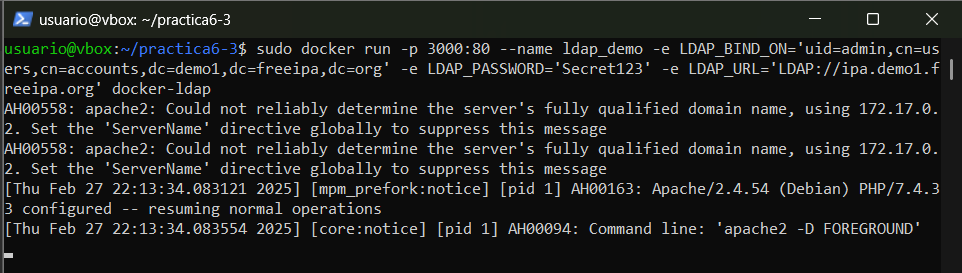

### Comprobación

Ahora solo tenemos que entrar en [http://IP-EC2:3000/demo](http://192.168.76.147:3000/demo) para comprobar que se ha desplegado el contenedor correctamente. Nos pedirá nuestras credenciales las cuales son:

* usuario: admin
  
* contraseña: Secret123

Una vez en la web veremos algo similar a la siguiente assets/images3/imagen:

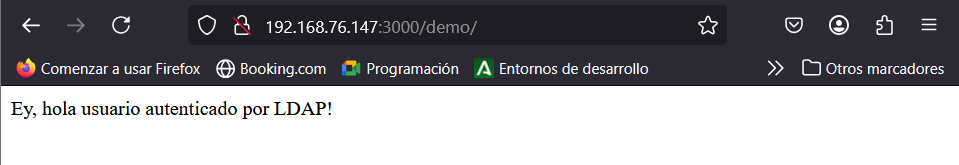

------
Author: Jorge Pradillo Hinterberger