# Práctica 6.1 - Dockerización del despliegue de una aplicación Node.js

## Introducción

En esta práctica, dockerizaremos una aplicación `Node.js` que interactúa con una API para gestionar un libro de direcciones almacenado en una base de datos `PostgreSQL`. El objetivo es ejecutar la aplicación en contenedores, aprendiendo a manejar `Docker` y `Docker Compose` para una configuración eficiente y modular.

## Parte 1: Configuración inicial

### Clonación del repositorio

Comenzamos clonando el repositorio del proyecto en nuestra máquina `Debian`:

```bash
git clone https://github.com/raul-profesor/DAW_practica_6.1_2024.git
cd DAW_practica_6.1_2024
```

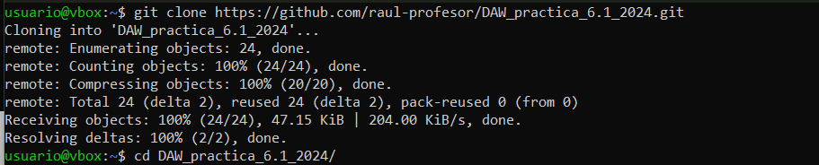

### Instalación de Docker en el sistema

Luego tenemos que instalar Docker en nuestra maquina virtual ejecutando el comando:

```bash
sudo apt install -y docker.io
```

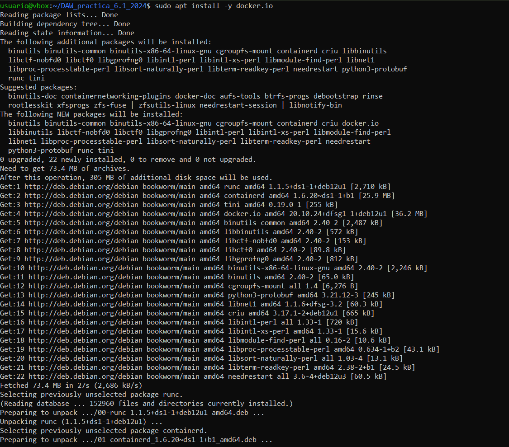

### Creación del Dockerfile

El archivo **Dockerfile** será utilizado para crear la imagen del contenedor de la aplicación Node.js. Aquí está el contenido completo del archivo, con las instrucciones necesarias completadas:

```dockerfile
# Utilizar la imagen base de Node.js
FROM node:18.16.0-alpine3.17

# Crear el directorio de la aplicación en el contenedor
WORKDIR /opt/app

# Copiar los archivos package.json y package-lock.json al contenedor
COPY src/package.json src/package-lock.json . 

# Instalar las dependencias de la aplicación
RUN npm install

# Copiar el código fuente de la aplicación al contenedor
COPY src/ .

# Exponer el puerto 3000
EXPOSE 3000

# Comando para iniciar la aplicación en modo desarrollo
CMD ["npm", "run", "start"]
```

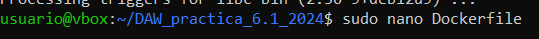
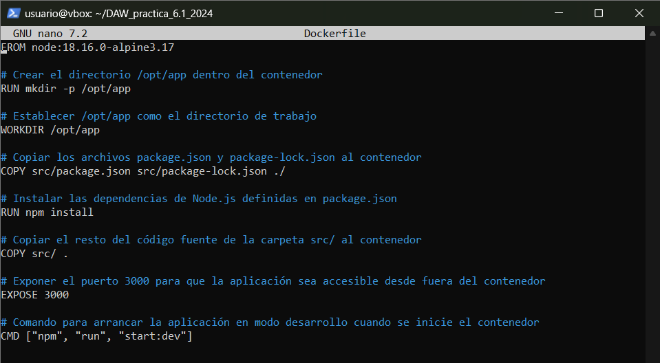

### Construcción de la imagen de Docker

Construimos la imagen a partir del archivo `Dockerfile`. Asignamos el nombre `librodirecciones` a la imagen:

```bash
sudo docker build -t librodirecciones .
```

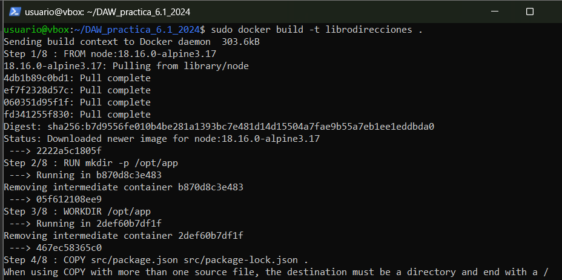

### Ejecución del contenedor

Iniciamos el contenedor con el comando siguiente, exponiendo el `puerto 3000` del contenedor en el `puerto 3000` de la `máquina anfitriona`:

```bash
sudo docker run -p 3000:3000 -d librodirecciones
```

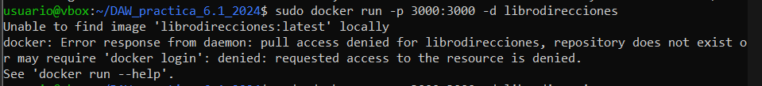

Si te da este error tienes que cambiar la configuración del `Dockerfile` y añadir una `/` al final de la línea: 

```dockerfile
COPY src/package.json src/package-lock.json ./
```

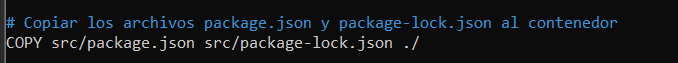

Volvemos a ejecutar el siguiente comando para que se puedan instalar las dependencias y se cree la imagen Docker.

```bash
sudo docker build -t librodirecciones .
```

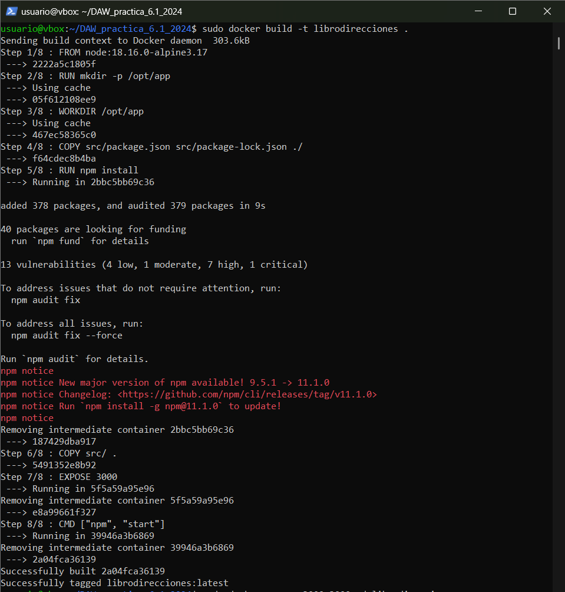

Volvemos a intentar iniciar el contenedor y que escuche las peticiones en el puerto 3000.

```bash
sudo docker run -p 3000:3000 -d librodirecciones
```

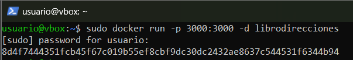

### Comprobación de la configuración

Tras ejecutar todos los comandos, si intentamos acceder a [http://192.168.9.147:3000](http://192.168.9.147:3000) nos debería aparecer un mensaje de error de conexión.

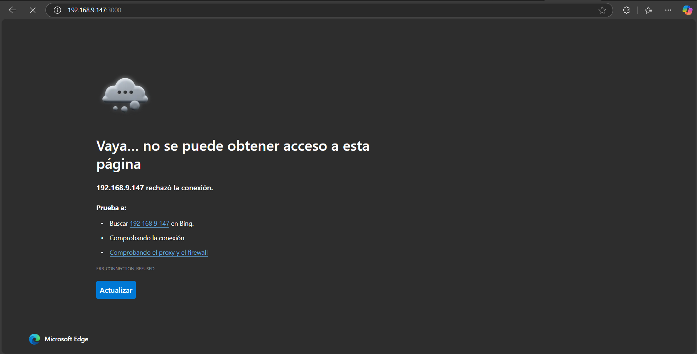

## Parte 2: Configuración con Docker Compose

La conexión entre la aplicación y la base de datos `PostgreSQL` requiere que ambos contenedores estén en la misma red. Utilizamos `Docker Compose` para gestionar estos contenedores de manera eficiente.

Antes de seguir tenemos que tener instalado `Docker Compose` en el sistema. Para ello simplemente tenemos que ejecutar el siguiente comando:

```bash
sudo apt update
sudo apt install docker-compose
```

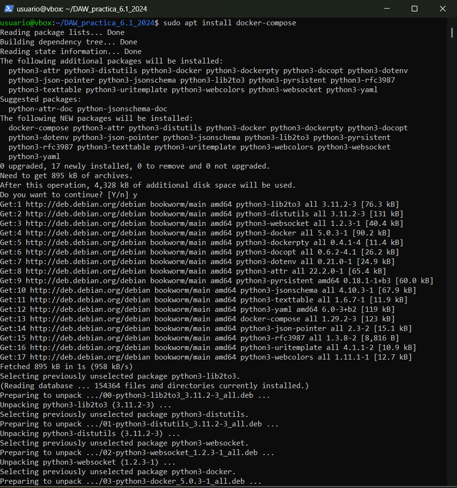

### Archivo docker-compose.yml

Este archivo define los servicios para la base de datos `PostgreSQL` y la aplicación `Node.js`. A continuación, el contenido completo:

```yaml
version: "3.9"
services:
  postgres:
    image: postgres:latest
    environment:
      POSTGRES_USER: postgres
      POSTGRES_PASSWORD: postgres
    ports: 
      - '5432:5432'
    volumes:
      - addressbook-db:/var/lib/postgresql/data

  addressbook:
    build:
      context: .
    environment:
      DB_SCHEMA: postgres
      DB_USER: postgres
      DB_PASSWORD: postgres
      DB_HOST: postgres
    depends_on:
      - postgres
    ports:
      - '3000:3000'

volumes:
  addressbook-db:
```

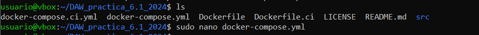
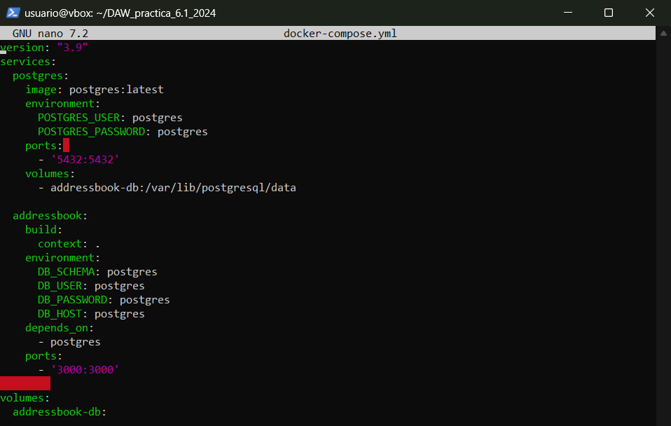

#### Resumen del flujo
**`postgres`**:
- Inicia una base de datos PostgreSQL en el puerto 5432.
- Guarda los datos de forma persistente en el volumen addressbook-db.
  
**`addressbook`**:
- Construye una aplicación (a partir del Dockerfile) que utiliza PostgreSQL como su base de datos.
- Se conecta a postgres usando las credenciales y configuración proporcionadas en las variables de entorno.
- Expone su interfaz en el puerto 3000.

**`Volúmenes`**:
- El volumen addressbook-db asegura que los datos de PostgreSQL sean persistentes y no se pierdan si el contenedor se elimina.

### Construcción y levantamiento de los contenedores

Ejecutamos las migraciones necesarias para crear las tablas en la base de datos:

```bash
sudo docker-compose run addressbook npm run migrate
```

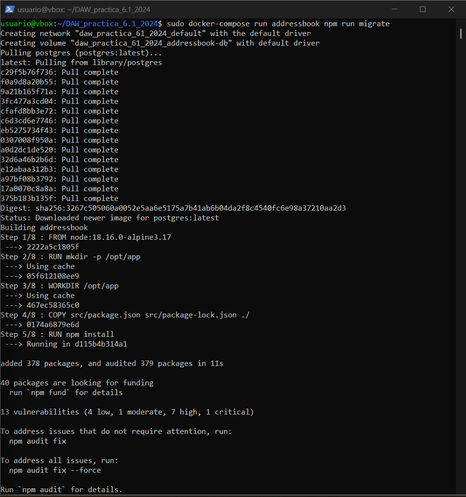

Construimos los contenedores con las imágenes y levantamos los servicios:

```bash
sudo docker-compose up --build -d
```

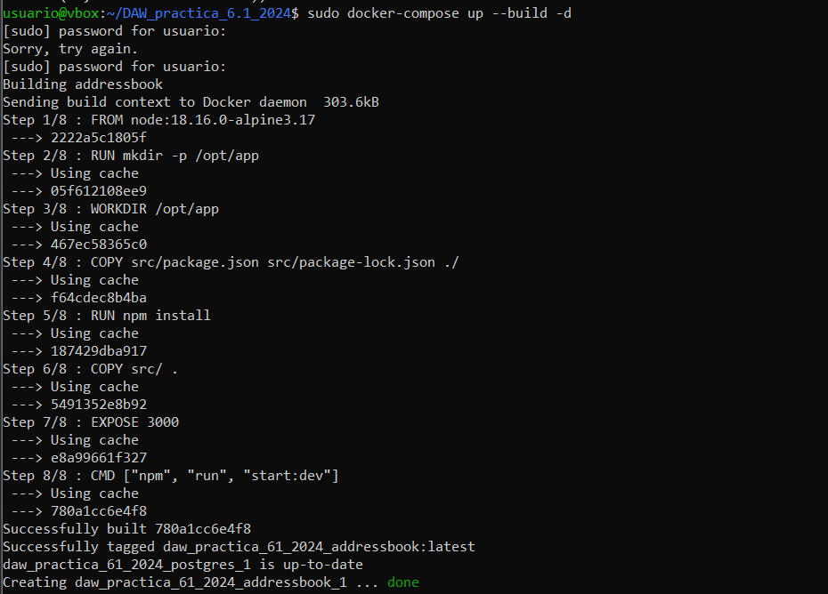

### Comprobación

Hacemos un test para comprobar que se hayan levantado correctamente todos los servicios con el comando:

```bash
sudo docker-compose run addressbook npm test
``` 

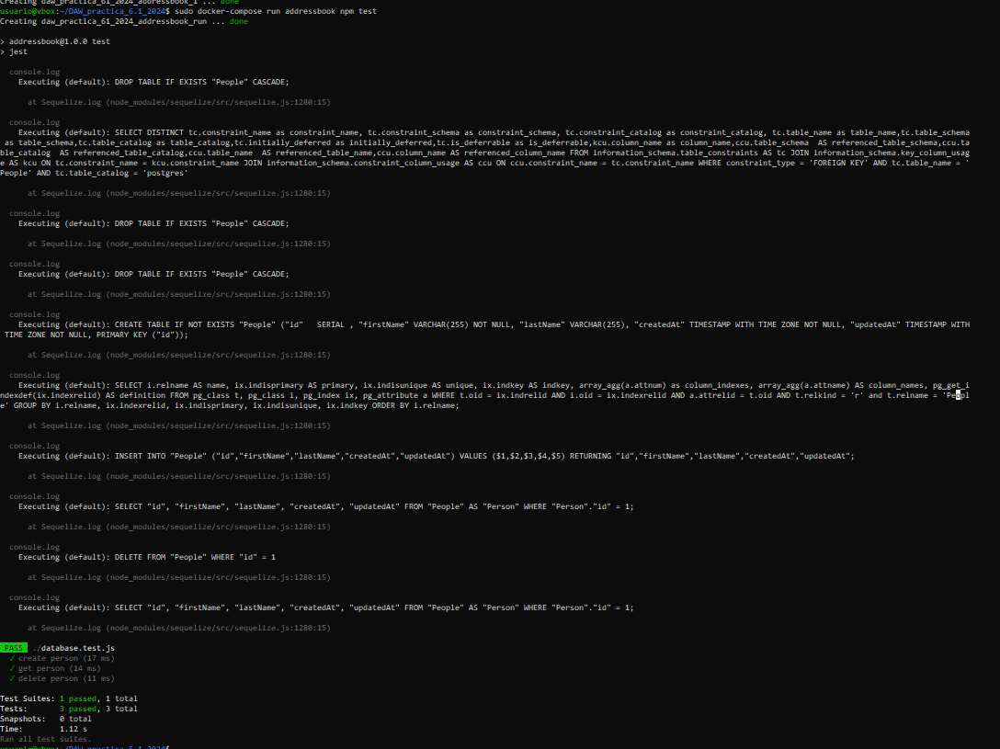

## Parte 3: Pruebas de funcionamiento

La API expone los siguientes endpoints que podemos probar utilizando `curl`:

### Añadir una persona al libro de direcciones

Comando:

```bash
curl -X PUT http://localhost:3000/persons -H 'Content-Type: application/json' -d '{"id": 1, "firstName": "Raúl", "lastName": "Profesor"}'
```

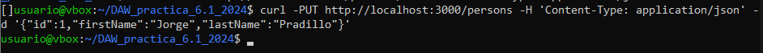

### Obtener todas las personas

Comando:

```bash
curl -X GET http://localhost:3000/persons -H 'Content-Type: application/json'
```

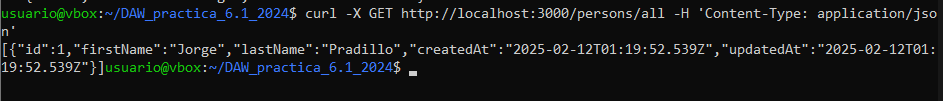


### Obtener una persona por ID

Comando:

```bash
curl -X GET http://localhost:3000/persons/1 -H 'Content-Type: application/json'
```

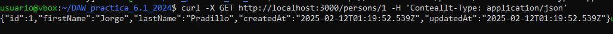

### Eliminar una persona por ID

Comando:

```bash
curl -X DELETE http://localhost:3000/persons/1 -H 'Content-Type: application/json'
```

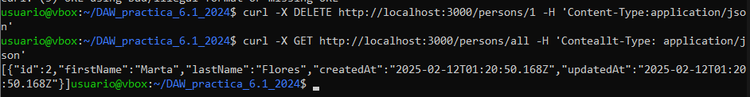

----------
Author: Jorge Pradillo Hinterberger